# Yolo Workstation 工作站手册

Yolo Workstation 是 `yoloutils` 内置的 YOLO 数据集工作台。它把项目管理、图片标注、数据集创建、数据集部署、模型训练、模型验证、预测、算力服务器管理和帮助文档集中在一个本地
Web 页面中。

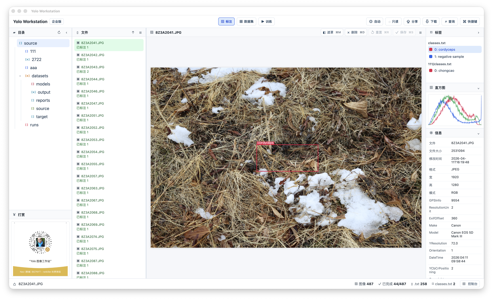

## 1. 启动工作站

前台运行：

```shell
python src/netkiller/yoloutils/yoloutils.py workstation -w /Users/neo/tmp/yolo/source
```

后台运行：

```shell
python src/netkiller/yoloutils/yoloutils.py workstation -w /Users/neo/tmp/yolo/source -d
```

常用参数：

```shell
python src/netkiller/yoloutils/yoloutils.py workstation \
  --workspace /Users/neo/tmp/yolo/source \
  --host 127.0.0.1 \
  --port 8000 \
  --edition community
```

参数说明：

| 参数                     | 说明                             |
|------------------------|--------------------------------|
| `-w, --workspace`      | 工作目录。所有项目、数据集、模型、日志都会围绕这个目录组织。 |
| `--host`               | 监听地址，默认 `127.0.0.1`。           |
| `-p, --port`           | 监听端口，默认 `8000`。                |
| `-d, --daemon`         | 后台运行。                          |
| `--team`               | 开启团队协作模式。                      |
| `--auth user:password` | 开启 HTTP Basic Auth。            |
| `--edition community   | enterprise`                    | 工作站版本，默认 `community`。 |

后台运行时会写入进程和日志文件。当前版本统一使用 `.workstation/workspace.log` 和项目内 `.project.log` 记录系统和项目事件。

## 2. 版本模式

社区版适合本地单人标注、数据集整理和本地训练。

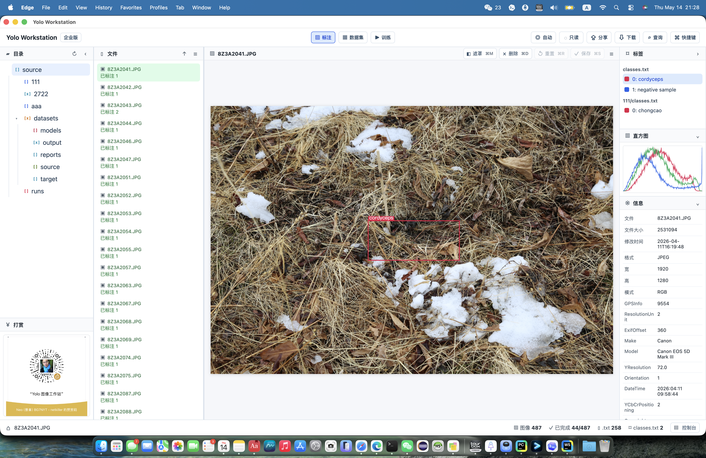

企业版增加团队协作、算力中心、远程训练、远程部署、Web SSH、Web SFTP 等能力。

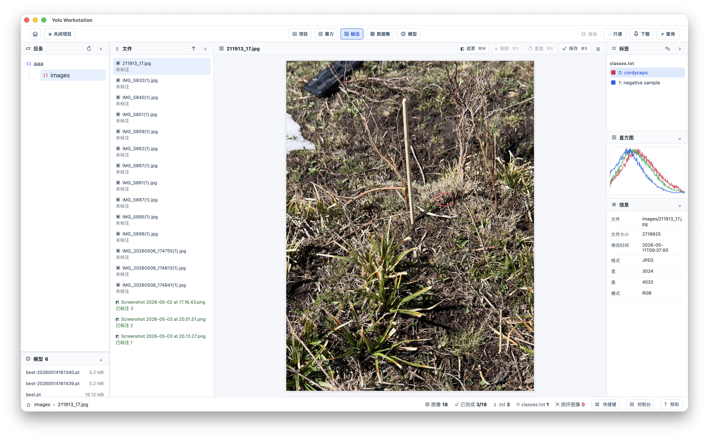

## 3. 工作目录结构

工作站以 `--workspace` 为根目录。推荐结构如下：

```text
workspace/
├── ProjectA/
│   ├── annotate/
│   │   ├── classes.txt
│   │   ├── image001.jpg
│   │   └── image001.txt
│   ├── test/
│   ├── datasets/
│   ├── models/
│   ├── runs/
│   └── .project.log
├── ProjectB/
└── .workstation/
    └── workspace.log
```

目录用途：

| 目录          | 用途                                                              |
|-------------|-----------------------------------------------------------------|
| `annotate/` | 标注图片、YOLO `.txt` 标签和 `classes.txt`。                             |
| `test/`     | 测试图片或预测输入素材。                                                    |
| `datasets/` | 由工作站创建的 YOLO 数据集。                                               |
| `models/`   | 用户上传或保存的 `.pt` 模型。                                              |
| `runs/`     | YOLO 训练输出，包括 `best.pt`、`last.pt`、`results.png`、`results.csv` 等。 |

创建数据集时，工作站会保留 `annotate/` 下的子目录结构，并生成新的 YOLO 数据集目录：

```text
datasets/name/
├── images/
│   ├── train/
│   │   ├── positive/
│   │   └── hard_negative/
│   ├── val/
│   └── test/
└── labels/
    ├── train/
    ├── val/
    └── test/
```

## 4. 项目列表

进入工作站后，项目页展示当前 workspace 中的项目。每个项目卡片显示图像、数据集、模型资源比例。点击项目卡片可打开项目。

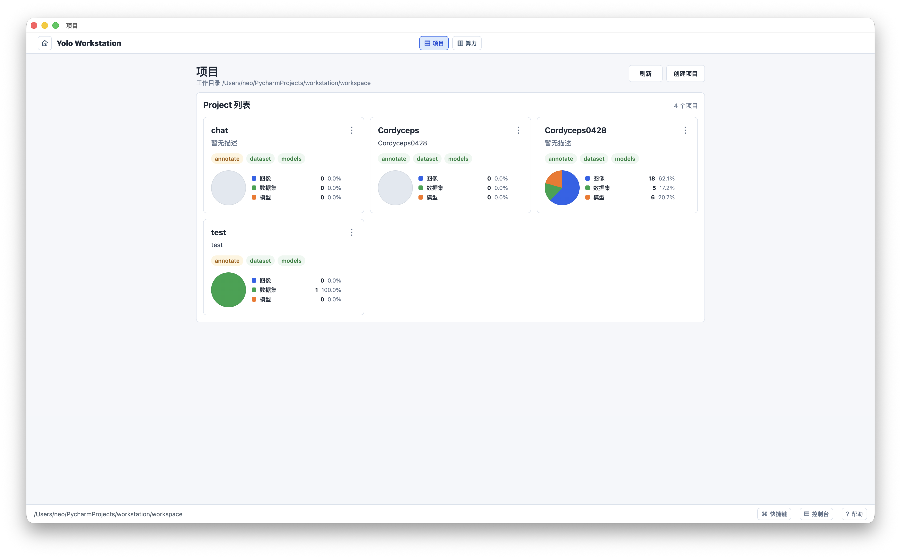

项目页操作：

- `刷新`：重新扫描 workspace，更新项目索引和资源统计。
- `创建项目`：创建新项目目录。
- 项目卡片：进入当前项目。

## 5. 打开项目

打开项目后，工作站所有功能都围绕当前项目运行。标题区显示当前项目名称、描述、刷新和关闭项目。

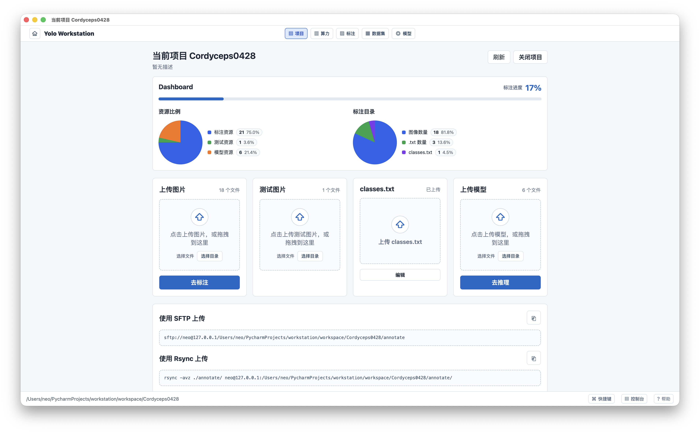

Dashboard 展示：

- 标注进度：按 `annotate/` 中图片与有效 `.txt` 计算。
- 资源比例：标注资源、测试资源、模型资源。
- 标注目录：图像数量、`.txt` 数量、`classes.txt` 数量。
- 上传入口：上传标注图片、测试图片、`classes.txt` 和模型文件。
- 上传命令：提供 SFTP 和 Rsync 命令，方便从本机或其他机器传入资源。

如果开启 `--team`，打开项目页会显示用户列表。未开启团队模式时，不显示团队、用户登录和注销入口。

## 6. 团队协作

团队模式通过 `--team` 开启。首次访问会进入 `/login`，输入用户名后进入团队页。

团队页包含：

- 在线用户列表。
- 每个用户当前打开的项目。
- 聊天区域。
- 两行文本输入框和发送按钮。

打开项目后，团队页、项目页、标注页、数据集页、模型页会共享当前项目上下文。关闭项目后回到项目列表。

## 7. 标注页面

标注页用于浏览图片、读取和保存 YOLO 标注、查看标签、直方图和图片信息。


主要区域：

| 区域  | 说明                                     |
|-----|----------------------------------------|
| 目录  | 展示当前项目目录树。默认围绕 `annotate/` 工作。         |
| 文件  | 展示当前目录图片列表和标注状态。                       |
| 图片  | 展示图片和 box，支持保存空 `.txt` 作为负样本。          |
| 标签  | 从 `annotate/classes.txt` 读取标签。         |
| 模型  | 展示项目 `models/` 下的 `.pt` 模型，选择后可启用自动识别。 |
| 协作  | 团队模式下展示打开当前项目的用户。                      |
| 直方图 | 展示当前图片 RGB 直方图。                        |
| 信息  | 展示文件信息和 EXIF。                          |

### 7.1 文件状态

文件列表使用不同状态提示：

- 已标注：存在同名 `.txt` 且内容有效。
- 未标注：没有同名 `.txt`。
- 空标注：同名 `.txt` 存在但为空，可作为负样本。
- 损坏图像：PIL 无法读取或校验失败。

### 7.2 折叠和拖动

标注页支持高频标注场景：

- 目录栏可折叠，释放空间给图片。
- 文件栏可折叠，图片区域底部显示上一张、文件名、下一张导航。
- 模型、协作、标签、直方图、信息区域可折叠。
- 多个分割条可拖动调整宽度或高度。
- 目录和文件同时折叠时，折叠条仍保留，方便恢复。

### 7.3 右键菜单

目录和文件支持右键菜单：

- 删除目录。
- 删除 `.txt` 文件。
- 创建负样本集 `.txt` 空文件。
- 文件名和扩展名转小写。
- 文件名和扩展名转大写。
- 重命名。
- 分享。

涉及删除或重命名的操作会弹出确认对话框。

### 7.4 快捷键

常用快捷键：

| 快捷键                    | 作用          |
|------------------------|-------------|
| `Cmd + 1` 到 `Cmd + 9`  | 选择对应索引标签。   |
| `Cmd + \`` 或 `Cmd + ·` | 选择 `0` 号标签。 |
| `Cmd + M`              | 遮罩。         |
| `Cmd + D`              | 删除当前标注。     |
| `Cmd + R`              | 重置当前图片标注。   |
| `Cmd + S`              | 保存标注。       |
| `Cmd + H`              | 打开帮助。       |

## 8. 数据集

数据集页用于把当前项目的标注资源固化为 YOLO 训练数据集。

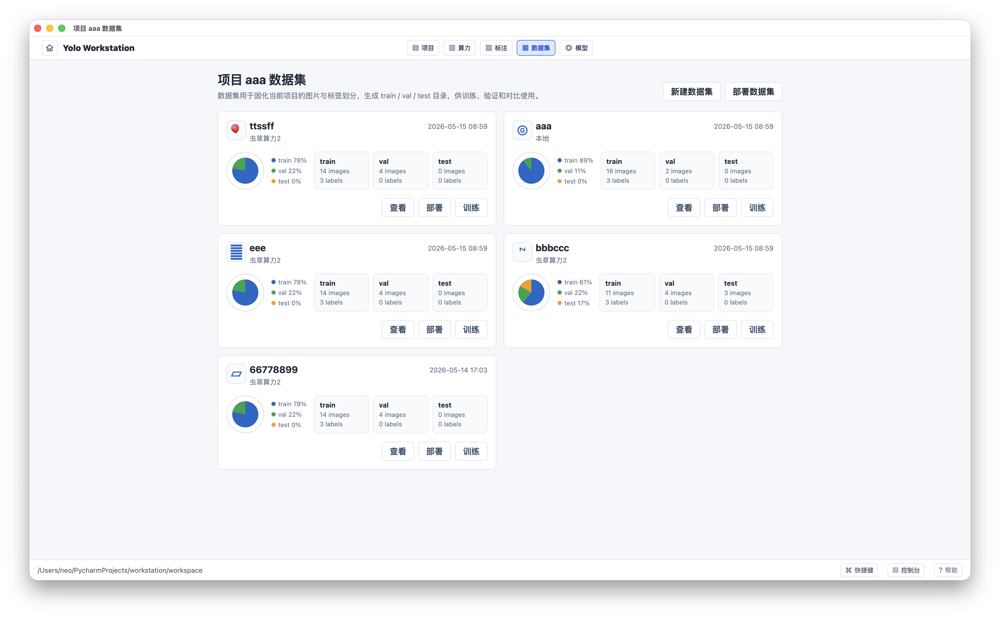

新建数据集流程：

1. 确认 `annotate/classes.txt` 存在。如果不存在，不允许创建。
2. 输入数据集名称。
3. 选择或随机切换数据集图标。
4. 设置 `val` 和 `test` 比例。
5. 可选勾选“数据集部署”。
6. 点击确认后创建数据集卡片。

创建时卡片会展示进度遮罩。完成后显示操作按钮。

数据集卡片操作：

| 操作 | 说明                          |
|----|-----------------------------|
| 查看 | 查看数据集内容。                    |
| 下载 | 打包下载数据集。                    |
| 训练 | 进入训练页并锁定该数据集。               |
| 部署 | 执行一次部署任务。                   |
| 删除 | 删除本地数据集；如果已部署，可选择是否删除远程数据集。 |

删除和下载入口收纳在“查看”里，避免卡片操作过多。

## 9. 数据集部署

数据集部署用于把当前项目的数据集部署到算力服务器。

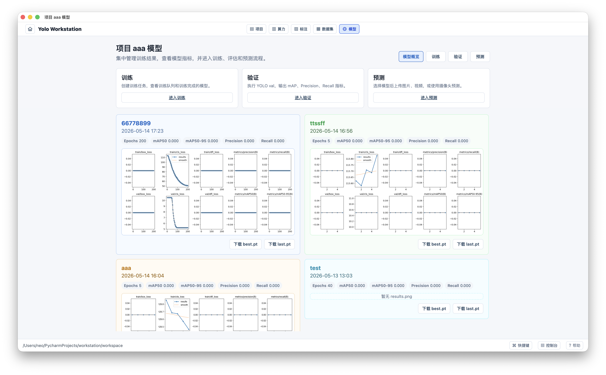

部署任务字段：

- 数据集名称。
- 算力服务器。
- 部署位置，默认 `~/datasets/<dataset name>`。
- 部署方式：`全量` 或 `同步`。
- 创建时间。
- 任务状态。

部署方式：

| 方式 | 说明                                |
|----|-----------------------------------|
| 全量 | 目标目录不存在时执行完整复制；如果目录已存在，会提示是否删除覆盖。 |
| 同步 | 对比本地与远程，只同步差异文件。                  |

传输工具优先使用 `rsync`。如果远程或本地环境不满足 `rsync` 条件，会退回到基于 SSH/SFTP 的复制逻辑。

任务列表支持：

- 查看：打开底部控制台，实时查看复制进度和日志。
- 失败重试：失败任务可重新执行。
- 完成任务可直接进入训练。

控制台位于 footer 下方，可拖动改变高度。

## 10. 模型中心

模型页集中展示训练结果、训练、验证和预测功能。只有打开项目后，header 才显示“模型”。

模型概览展示 `runs/` 下包含 `.pt` 权重的训练结果。每个模型卡片展示 `results.png` 预览，点击进入指标页面。

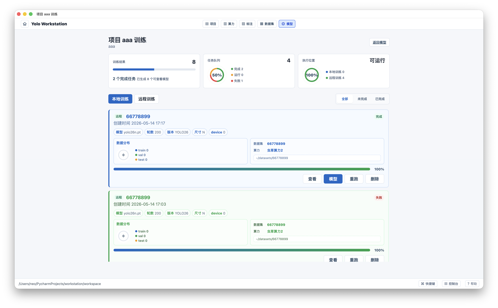

模型页子功能：

| 子功能 | 路由                               | 说明                    |
|-----|----------------------------------|-----------------------|
| 概览  | `/model/<project>`               | 展示 runs 下训练结果。        |
| 训练  | `/model/<project>/train`         | 创建本地或远程训练任务。          |
| 验证  | `/model/<project>/val`           | 执行 YOLO val。          |
| 预测  | `/model/<project>/predict`       | 图片、视频、摄像头预测。          |
| 指标  | `/model/<project>/metrics/<run>` | 查看训练结果图表、CSV、参数和导出模型。 |

## 11. 训练

训练页支持本地训练和远程训练。训练任务使用 `tmux` 启动，避免终端退出导致训练中断。

训练入口：

- 从数据集卡片点击训练：锁定该数据集，不能修改。
- 从模型页进入训练：可以自由选择数据集。

远程训练要求：

- 数据集已经部署到算力服务器。
- 远程服务器能执行 `yolo` 命令。
- 训练完成后会把远程 `runs` 内容下载回本地项目。

训练任务卡片展示：

- 本地或远程标识。
- 任务创建时间。
- 数据集名称。
- 模型、轮数、YOLO 版本、图片尺寸等参数。
- 数据分布饼图。
- 进度条。
- 查看日志、监控算力、停止、删除、重跑。

重跑不会创建新任务，会复用当前任务记录重新执行。

## 12. 验证

验证页对应 YOLO `val`。

使用方式：

1. 拖放或浏览上传 `.pt` 模型。
2. 从数据集列表选择数据集。
3. 设置 split，默认 `val`。
4. 启动验证。
5. 打开控制台查看实时进度。

验证结果记录在项目的验证任务目录中，便于后续对比。

## 13. 预测

预测页用于对训练好的模型做推理。

支持输入：

- 多张图片上传。
- 视频上传。
- 摄像头拍照。
- 摄像头视频。

模型列表展示 `runs/` 下训练出来的模型名称，不直接展示单个 `.pt` 文件。用户选择模型后再上传素材执行预测。

## 14. 算力

算力页管理远程服务器。

功能：

- 添加算力服务器。
- 编辑服务器。
- 查看服务器详情。
- OpenSSH：进入 Web SSH 终端。
- SFTP：进入 Web SFTP 工具。
- 检查：检查 CUDA、YOLO、`netkiller-yoloutils` 等工具是否安装。
- 购买算力和算力合作入口。

添加算力时会通过 SSH 获取并保存服务器信息到：

```text
workspace/.resources.json
```

保存的信息包括：

- 主机名。
- 系统版本。
- CPU 数量。
- 内存容量。
- 磁盘容量。
- 显卡数量。
- 显存容量。

这样列表页不需要每次重新连接远程服务器，打开速度更快。

服务器详情展示：

- 服务器基础信息。
- CPU 使用率和每个 CPU 的柱状图。
- 内存饼图和历史折线图。
- 磁盘饼图和历史折线图。
- 磁盘 IO 折线图。
- 网络折线图。
- GPU、显存和温度。

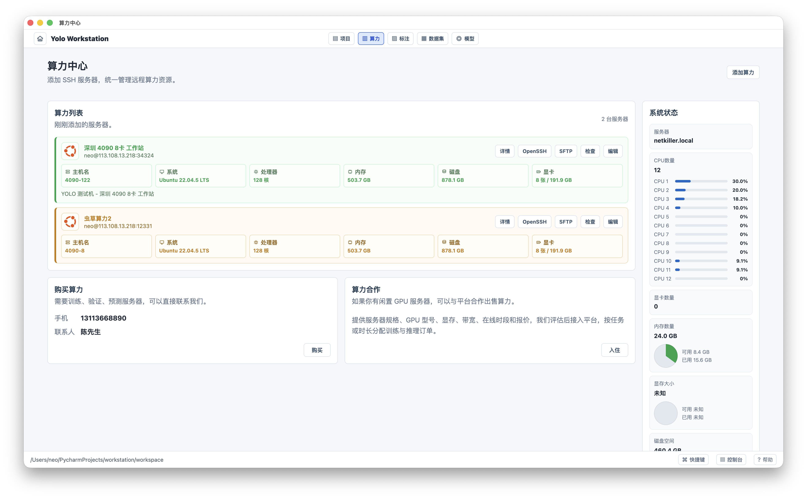

## 15. Web SSH 和 Web SFTP

OpenSSH 用于在浏览器中连接远程服务器。终端支持 ANSI Color、中文输入、回车、删除键等常用终端行为。

SFTP 用于浏览远程服务器文件，配合数据集部署和远程训练检查目录内容。

连接方式：

- 密码登录。
- 私钥登录。勾选私钥证书后，密码会清空并禁用，可以粘贴或上传私钥。

## 16. 帮助

帮助入口位于 footer 右侧。快捷键面板和帮助页面是两个独立功能。

帮助路由：

| 路由                   | 说明       |
|----------------------|----------|
| `/help`              | 帮助首页。    |
| `/help/install.html` | 环境安装说明。  |
| `/help/manual.html`  | 工作站操作手册。 |

环境安装示例：

```shell
python3.14 -m venv /srv/python
source /srv/python/bin/activate
python -m pip install --upgrade pip
pip3 install torch torchvision --index-url https://download.pytorch.org/whl/cu130
pip install netkiller-yoloutils -i https://pypi.tuna.tsinghua.edu.cn/simple --upgrade

# 日常升级
pip install -U ultralytics --upgrade
```

## 17. 上传方式

项目打开页提供多种上传方式。

浏览器上传：

- 标注图片上传到 `annotate/`。
- 测试图片上传到 `test/`。
- `classes.txt` 上传到 `annotate/classes.txt`。
- 模型上传到 `models/`。

命令上传：

```shell
sftp://user@host/path/to/workspace/Project/annotate
```

```shell
rsync -avz ./annotate/ user@host:/path/to/workspace/Project/annotate/
```

上传日志写入项目 `.project.log`，控制台可以查看。

## 18. 日志

日志分两层：

| 日志                                     | 说明                          |
|----------------------------------------|-----------------------------|
| `workspace/.workstation/workspace.log` | 工作站级日志，记录项目列表、系统错误、全局资源操作。  |
| `workspace/<project>/.project.log`     | 项目级日志，记录上传、标注、数据集、部署、训练等事件。 |

日志设计原则：

- `annotate/` 和 `test/` 目录不写入无关业务文件。
- 上传图片、文件、模型、`classes.txt` 都写入日志。
- 控制台展示日志时尽量保持单行记录，方便搜索和复制。

## 19. 路由速查

| 页面      | 路由                                    |
|---------|---------------------------------------|
| 登录      | `/login`                              |
| 团队      | `/team`                               |
| 项目列表    | `/project`                            |
| 打开项目    | `/project/<project>`                  |
| 标注      | `/annotate/<project>`                 |
| 数据集     | `/dataset/<project>`                  |
| 数据集部署   | `/dataset/<project>/deploy`           |
| 指定数据集部署 | `/dataset/<project>/deploy/<dataset>` |
| 算力      | `/resources/<project>`                |
| 模型概览    | `/model/<project>`                    |
| 训练      | `/model/<project>/train`              |
| 验证      | `/model/<project>/val`                |
| 预测      | `/model/<project>/predict`            |
| 模型指标    | `/model/<project>/metrics/<run>`      |
| 帮助      | `/help`                               |

## 20. 截图索引

下面是文档目录中的补充截图，便于快速对照界面变化。

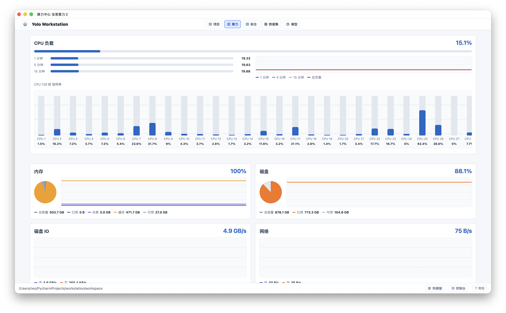

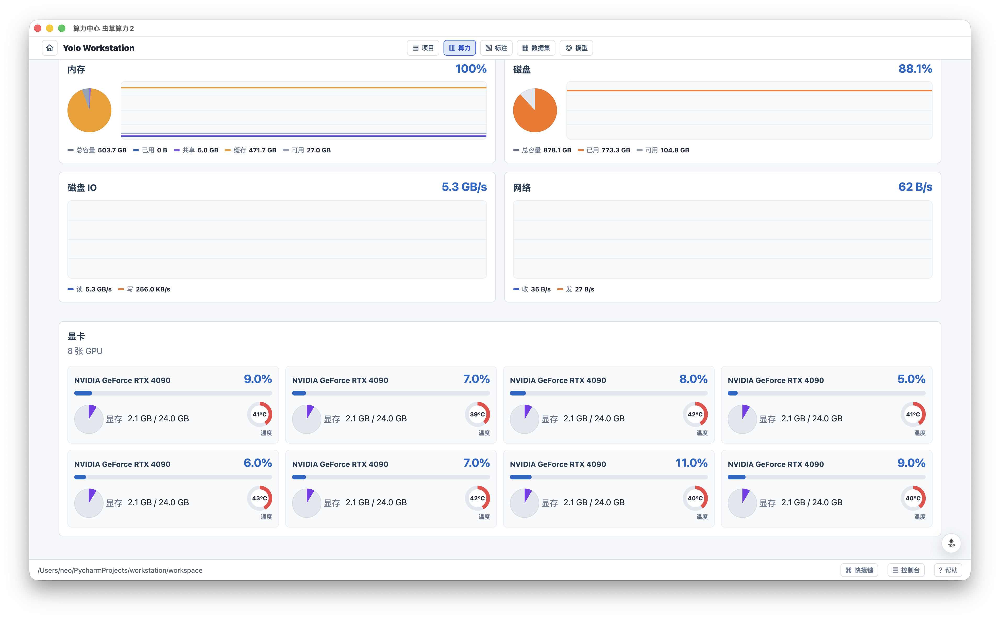

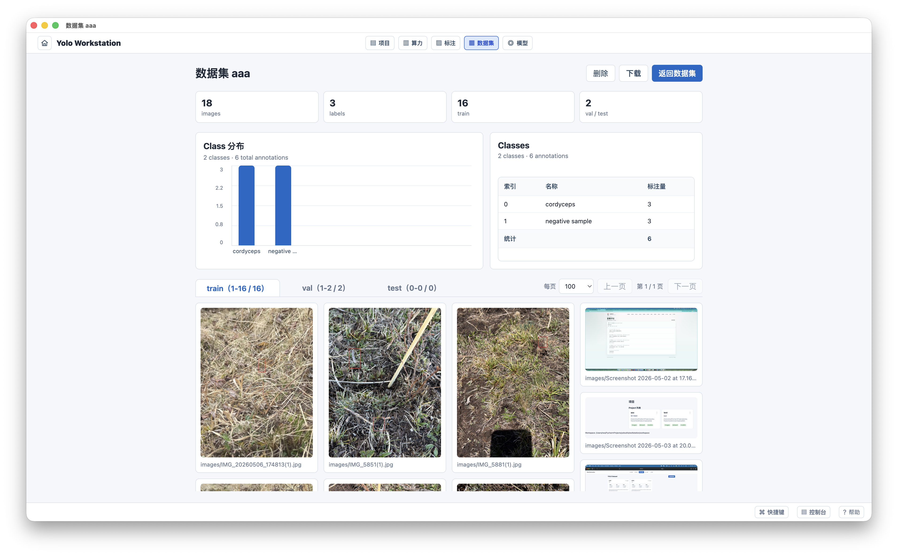


